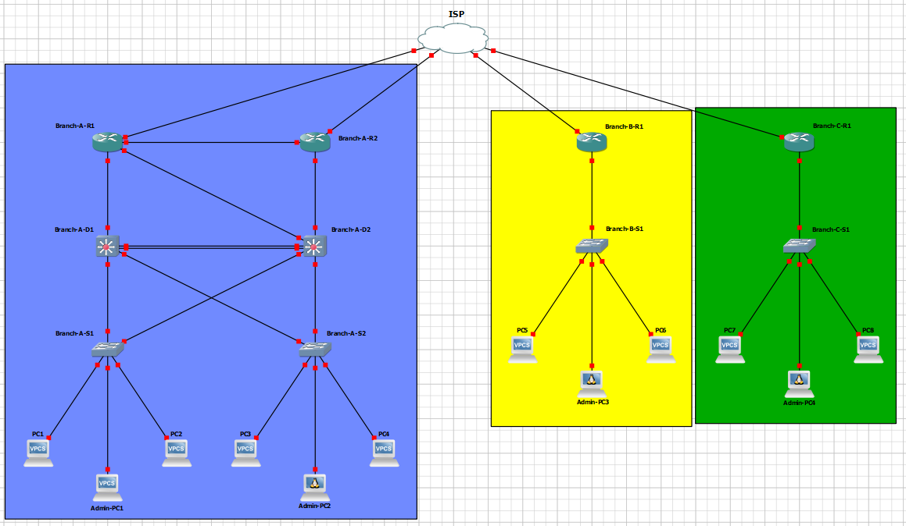

<h1 align="center">
   
  
   
  Network Automation Project - ITQ College
   
</h1>

<h4 align="center">Ansible - Advertise Masage of the day on Cisco-IOS network devices in a Campus design.</h4>

  <a href="#basic-overview">Basic Overview</a> •
  <a href="#key-features">Key Features</a> •
  <a href="#contributing">Contributing</a> 

    

## Basic Overview
* This repository contains the network automation project that showcases the design, configuration, and security of a multi-branch organizational network, utilizing various technologies such as OSPF, GRE over IPsec, VLANs, and Ansible Automation playbook.
  -  you can find a PPTX (slide-show) file in the doc folder for more detailed description of the project.
  
* The network consists of 3 branches (1 main branch and 2 secondary branches) connected via an ISP for general access. The network includes:
  - Main Branch (A):
    - Two routers (R1, R2) with OSPF for dynamic routing.
    - Distribution Switches (DSW1 and DSW2) with HSRP acting as gateways for VLANs.
    - VLANs for Business Departments, IT team, and Management.
    - DSW1 is the primary root for VLANs 10 and 99; DSW2 for VLAN 20.
  - Secondary Branches (B & C):
    - One switch and one router each, serving as DHCP servers and gateways using Router on a Stick (ROAS).

* Topology image:

## Key Features
The network is equipped with the following features:
* GRE over IPsec: Provides secure tunneling between branches using point-to-point connections.
  - Dynamic routing through OSPF over the tunnel.

* Unique ISAKMP keys and IPsec profiles for each tunnel.
* OSPF (Open Shortest Path First): Used for dynamic routing between all routers in the network.
  - Equal-Cost Multi-Path (ECMP) for redundancy and efficient traffic distribution.
  - Site-to-Site (S2S) neighboring relationships established via OSPF.
* Router on a Stick (ROAS): Configured for VLANs in secondary branches, simplifying routing and gateway services.
* HSRP (Hot Standby Router Protocol): Provides gateway redundancy for VLANs in the main branch.
  - DSW1 as the active router for VLANs 10 and 99, DSW2 for VLAN 20.
  - Virtual IP addresses configured for gateway services with priority settings.
* LACP (Link Aggregation Control Protocol): Used to aggregate multiple physical links for increased bandwidth and redundancy.
* PVST (Per-VLAN Spanning Tree): Configured for loop prevention and efficient traffic management in VLANs.
* Automation with Ansible: Ansible playbooks are used to automate the advertisement of Message of the Day (MOTD) to all Cisco network devices, ensuring consistent communication across the network.

### Security
* The network has multiple security measures in place to ensure stability and prevent unauthorized access:
  - Port Security: Limiting MAC addresses and enabling sticky MAC on critical ports.
  - DHCP Snooping: Prevents DHCP spoofing by ensuring only trusted ports forward DHCP offers.
  - Spanning Tree Guard Root: Protects against unwanted changes to the Root Bridge.
  - Access Control: VTY lines secured with ACLs, Telnet disabled and all devices share a consistent security policy.
  - Unused Ports: Disabled across the network to prevent unauthorized access.
  - Encryption: SSH, End-to-end encryption between routers in different branches to enhance network security.

### Automation Tool
* The Message of the Day (MOTD) configuration is automated and deployed to all network devices.
- Playbook: Written in YAML format, the playbook reads from a text file containing the MOTD and applies it to all devices, saving the configuration to startup files.
- Host File Configuration: The playbook can reference individual branches or the entire network for targeted automation.

## Contributing
* please feel free to contact for colaboration or if you find any issues, or just want to tell me something.
  - **My Discord**: [mrmeeseeks404](https://discord.com/users/userid/mrmeeseeks404) 📫
* coming up next
  - How to install & Use GNS3 and common troubleshooting.
  - More GNS3 networks using differents Dynamic Routing Protocols, such as EIGRP, BGP...
